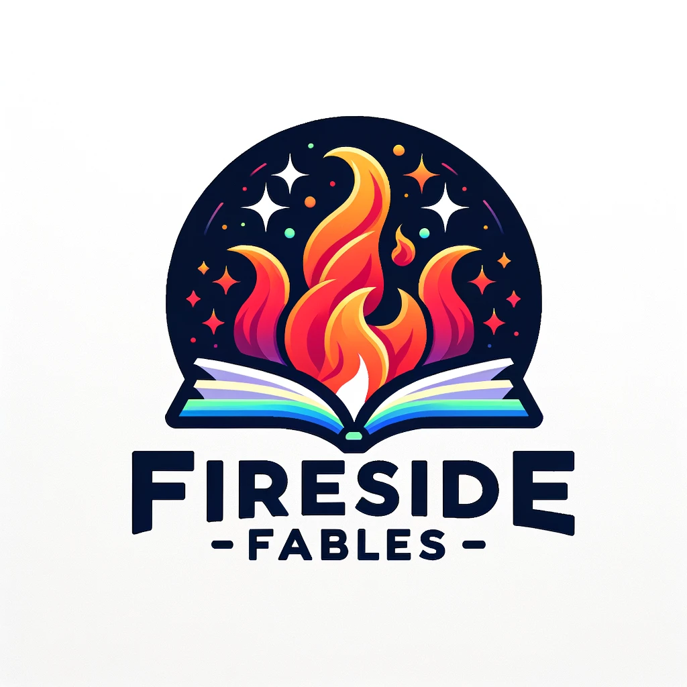

<div style="text-align: center;">
    
</div>

# Fireside Fables

Fireside Fables is a web app that generates unique bonfire stories by weaving together user-provided story elements. This project is a celebration of 10 years of Hack Western, a hackathon run by students at the University of Western Ontario.

## Installation Instructions

Follow these steps to get a development environment running for this repository:

1. Clone the repository to your local machine.
2. Ensure you have Python installed. If not, download and install it from [here](https://www.python.org/downloads/).
3. Install pip, a package manager for Python. You can find instructions [here](https://pip.pypa.io/en/stable/installation/).
4. Navigate to the project directory and install the required dependencies using pip:
    ```bash
    pip install -r requirements.txt
    ```
5. Create a `.env` file in the `fireside_fables_app` directory and add your OpenAI API Key:
    ```env
    OPENAI_API_KEY=your_api_key_here
    ```

## Usage Instructions

To run the project:

1. Create an OpenAI account and generate an OpenAI API Key. Set this key as an environment variable in the `.env` file.
2. Run the application using the command `python3 app.py` in the terminal.
3. Open the link returned in a standard web browser to view the application.


## Author and Acknowledgment

Jimmy Li is the author of this repository. This project was inspired by the theme of Hack Western 10 - Kindling 10 Years of Memories. External material referenced include the ["Build a Chatbot with OpenAI GPT-3 using Flask"](https://www.educative.io/projects/build-a-chatbot-with-openai-gpt3-using-flask) project from Educative.io, OpenAI API documentation, and DALL•E for generating the logo for Fireside Fables web app.

## Technologies Used

This project uses the following technologies:

- Python
- Flask
- SQLAlchemy
- OpenAI
- DigitalOcean (for deployment)

## Demo Video

You can view a demo of the project [here](https://www.loom.com/share/37c886171cc84776bffa739743807661?sid=2a9e081a-c69b-4d80-b254-7a2b2d21c04b).

## Devpost Submission

You can view the Devpost submission for this project [here](https://devpost.com/software/fireside-fables).


## Contributing

We welcome contributions to this repository. Follow these steps:

1. Fork the repository.
2. Create a new branch for your changes.
3. Make your changes in your branch.
4. Submit a pull request with your changes.

Please ensure your code adheres to our style guide and passes all tests.